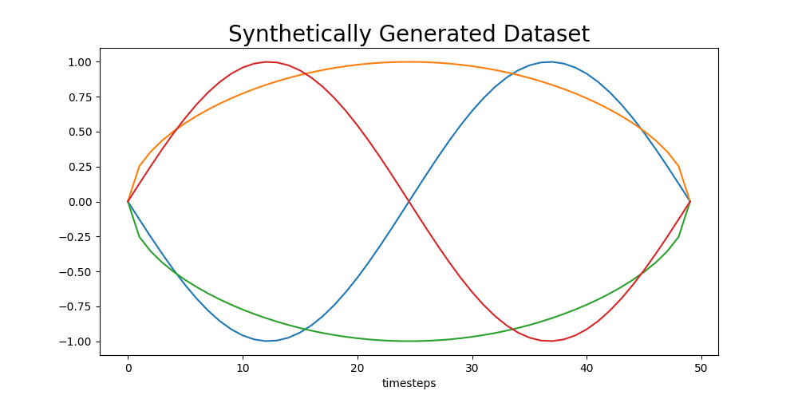
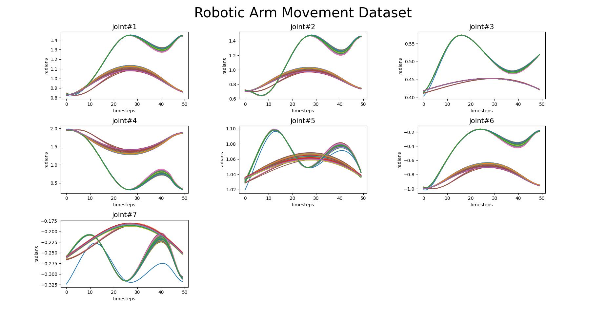

# C-CNMP Datasets used in Experiments
This repository contains datasets used in C-CNMP training and predictions.
All datasets are numpy arrays, persisted via Python pickle library.

## Synthetically Generated Dataset
Single dimensional synthetically generated dataset is composed of 4 different trajectories intersecting at different timesteps.

## Robotic Arm Movement Dataset
7 DoF robotic arm movement has been represented with joint angles(radians) at 50 consecutive timesteps.
Dataset is composed of 145 different movement trajectories.

